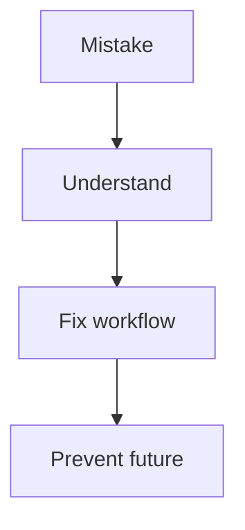

# 🎁 Bonus Resources (Git Mastery Toolkit)

> “This section turns knowledge into speed, efficiency, and real-world readiness.”

---

## 🧭 What You’ll Find Here


---

## 📚 Modules

### ⚙️ Commands

➡️ `01-Commands/`

* 100 most-used Git commands

---

### ❌ Mistakes

➡️ `02-Mistakes/`

* Common GitHub mistakes
* Real-world failures

---

### ⚡ Productivity

➡️ `03-Productivity/`

* Speed tips
* Git aliases

---

### 🧠 Best Practices

➡️ `04-Best-Practices/`

---

### 🚀 Roadmap

➡️ `05-Roadmap/`

---

### 📄 Cheat Sheets

➡️ `06-Cheat-Sheets/`

---

---

# 📄 `100-most-used-git-commands.md`

---

# ⚙️ 100 Most Used Git Commands

---

## 🧠 Basic

```bash
git init
git clone
git status
git add .
git commit -m "msg"
```

---

## 🌿 Branching

```bash
git branch
git checkout -b branch
git switch branch
git merge branch
git branch -d branch
```

---

## 🔄 History

```bash
git log --oneline
git log --graph
git show <commit>
git diff
```

---

## 🔁 Undo

```bash
git reset --soft HEAD~1
git reset --hard HEAD~1
git revert <commit>
git restore file
```

---

## 🌍 Remote

```bash
git remote add origin
git push
git pull
git fetch
```

---

## 🧠 Advanced

```bash
git reflog
git cherry-pick <commit>
git rebase -i HEAD~n
git stash
git stash pop
```

---

(continue expanding to 100 — keep grouped like above)

---

---

# 📄 `common-github-mistakes.md`

---

# ❌ Common GitHub Mistakes

---

## 🚫 Mistakes

```text
Committing secrets
Force pushing blindly
Working directly on main
Ignoring pull requests
Large commits
No commit messages
```

---

## 🧠 Fix Strategy



---

---

# 📄 `productivity-tips.md`

---

# ⚡ Git Productivity Tips

---

## 🧠 Key Tips

```text
Use git status constantly
Commit often (small commits)
Use branches for everything
Use aliases
Use stash wisely
```

---

## ⚡ Speed Boost

```bash
git config --global alias.st status
git config --global alias.co checkout
git config --global alias.lg "log --oneline --graph --all"
```

---

---

# 📄 `best-practices.md`

---

# 🧠 Git Best Practices

---

## 🔥 Core Rules

```text
Never commit sensitive data
Keep commits small & meaningful
Write clear commit messages
Avoid force push on shared branches
Use feature branches
```

---

## 🧭 Workflow


---

---

# 📄 `roadmap-to-git-mastery.md`

---

# 🚀 Roadmap to Git Mastery

---

## 🧭 Levels


---

## 🧠 What to Learn

### Beginner

* commands
* commits
* branches

---

### Intermediate

* merge
* rebase
* stash

---

### Advanced

* internals
* reflog
* debugging

---

### Master

* recovery
* workflows
* optimization

---

---

# 🏁 Final Recommendation

👉 Your repo is now:


