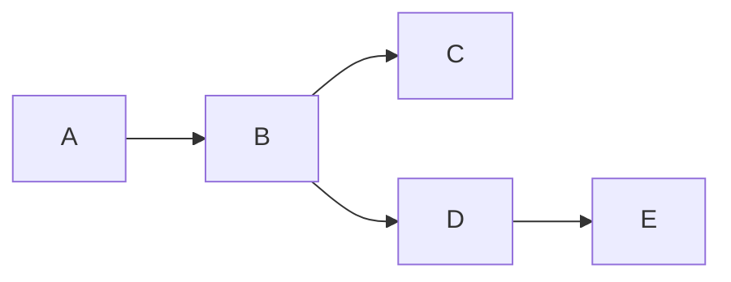
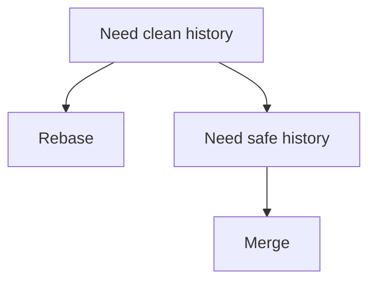

# 🔴 Git Advanced Cheat Sheet

> “At this level, you think in commits, not commands.”

---

## 🧠 Git Internal Model


```text
Blob   = file content
Tree   = directory
Commit = snapshot
Branch = pointer
HEAD   = current pointer
```

---

## 🧭 Commit Graph (DAG)



```text
Git = Directed Acyclic Graph (DAG)
```

---

## 🔀 Rebase (Deep)

```bash
git rebase main
git rebase -i HEAD~n
```

### 🧠 Actions

```text
pick    = keep commit
squash  = combine commits
reword  = edit message
drop    = delete commit
```

---

## 🔄 History Rewrite

```bash
git commit --amend
git rebase -i
```

⚠️ Never on shared branches

---

## ⚔️ Cherry-Pick

```bash
git cherry-pick <commit>
git cherry-pick A^..B
```

👉 Move specific commits

---

## 📦 Partial Commits

```bash
git add -p
```

👉 Stage selected changes

---

## 🧪 Stash (Advanced)

```bash
git stash save "msg"
git stash branch new-branch
git stash pop
```

---

## 🔍 Debug Commands

```bash
git log --graph --oneline --all
git show <commit>
git diff main..feature
git blame file.txt
```

---

## 🌍 Remote Control

```bash
git fetch
git pull --rebase
git push --force-with-lease
```

---

## ⚡ Advanced Workflow

```bash
git switch -c feature
git add -p
git commit -m "clean commit"
git rebase main
git push --force-with-lease
```

---

## ⚠️ Dangerous Commands

```bash
git reset --hard
git push --force
git rebase (on shared branch)
```

---

## 🧠 Golden Concepts

```text
Rebase rewrites history
Merge preserves history
Commit = snapshot, not diff
Branch = movable pointer
```

---

## 🧭 Decision Thinking



---

## 🏁 Outcome

```text
You understand how Git works internally
```
