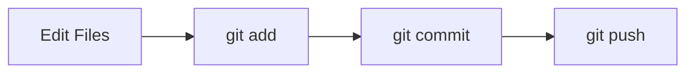

# 🟢 Git Beginner Cheat Sheet

> “Focus on the core workflow — nothing more.”

---

## 🧠 Git Basic Flow



---

## ⚙️ Core Commands (Must Know)

```bash
git init
git clone <url>

git status
git add .
git commit -m "message"

git log --oneline
```

---

## 🌿 Basic Branching

```bash
git branch
git switch -c feature
git switch main
git merge feature
```

---

## 🌍 Remote

```bash
git push
git pull
```

---

## 🧠 Key Concepts

```text
Repository = project
Commit = snapshot
Branch = pointer
```

---

## ⚡ Daily Workflow

```bash
git status
git add .
git commit -m "message"
git pull
git push
```

---

## ⚠️ Beginner Mistakes

```text
❌ skipping git status
❌ committing everything blindly
❌ working on main branch
```

---

## 🧠 Golden Rule

```text
Always check → git status
```

---

## 🏁 Outcome

```text
You can track and save changes safely
```
