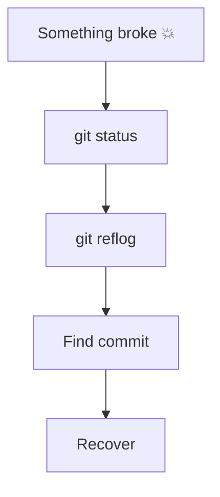
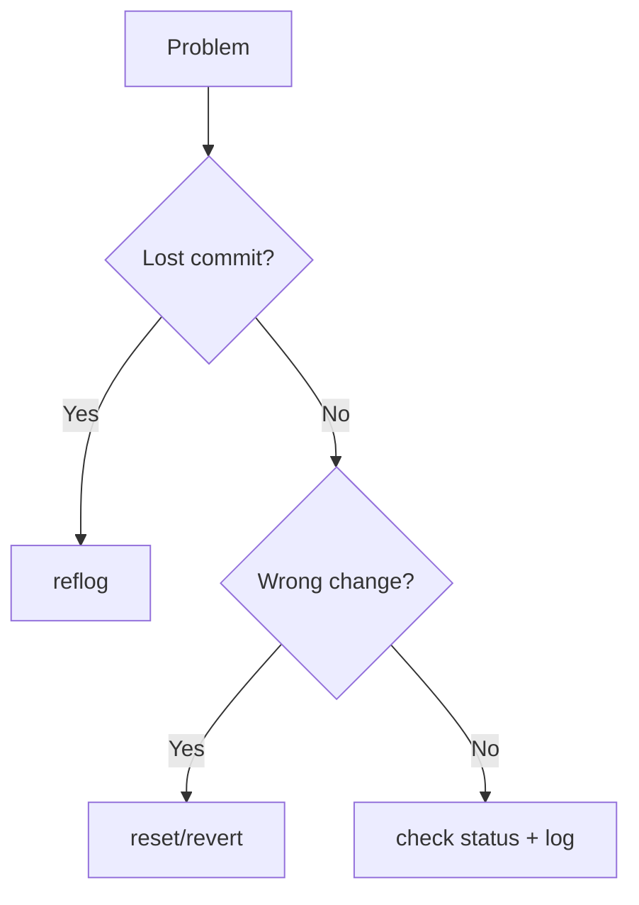

# 🚑 Git Emergency Recovery Cheat Sheet

> “When everything breaks — follow this.”

---

## 🧠 First Rule

```text
DON’T PANIC
```

---

## 🧭 Emergency Flow



---

## 🔥 Lost Commit

```bash
git reflog
git reset --hard <commit>
```

---

## 🔥 Deleted Branch

```bash
git reflog
git checkout -b recovered <commit>
```

---

## 🔥 Wrong Branch Commit

```bash
git cherry-pick <commit>
```

---

## 🔥 Undo Last Commit

```bash
git reset --soft HEAD~1
```

---

## 🔥 Undo Pushed Commit (SAFE)

```bash
git revert <commit>
```

---

## 🔥 Detached HEAD Fix

```bash
git checkout -b safe-branch
```

---

## 🔥 Merge Gone Wrong

```bash
git merge --abort
```

---

## 🔥 Rebase Gone Wrong

```bash
git rebase --abort
```

---

## 🔥 Restore Deleted File

```bash
git restore file.txt
```

---

## 🔥 Recover Old Version

```bash
git checkout <commit> -- file.txt
```

---

## 🔥 Force Push Disaster

```bash
git reflog
git checkout -b recovery <commit>
```

---

## 🔥 Clean Mistake

```bash
git fsck --lost-found
```

---

## 🧠 Recovery Toolkit

```bash
git reflog
git log --all
git fsck
git show <commit>
```

---

## ⚡ Golden Rules

```text
Reflog = time machine
Never panic
Create backup branch
Avoid force push blindly
```

---

## 🧭 Emergency Decision Tree



---

## 🏁 Outcome

```text
You can recover ANY Git mistake
```

---

---

# 🚀 Final Cheat Sheet System (Now Complete)


---

# 🏁 Final Thought

> “Beginners use Git.
> Advanced users control Git.
> Experts recover anything.”
