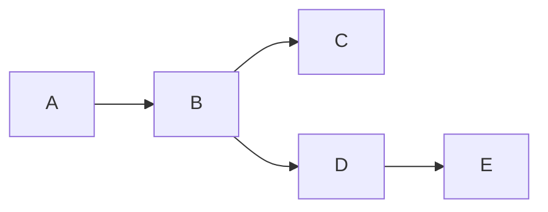
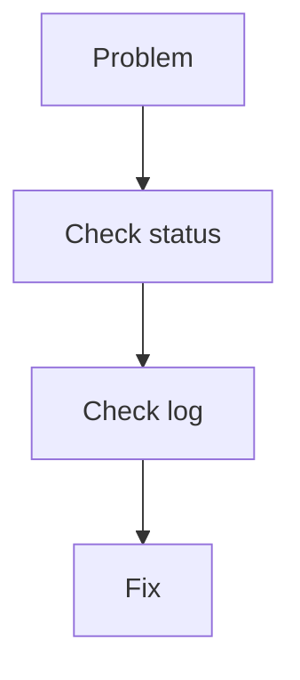

# 🟡 Git Intermediate Cheat Sheet

> “Now you control branches, history, and collaboration.”

---

## 🧠 Workflow Upgrade


---

## 🌿 Branching Power

```bash
git switch -c feature-x
git branch -d feature-x
git switch -
```

---

## 🔀 Merge vs Rebase

```text
Merge  = combine history (safe)
Rebase = clean history (linear)
```

---



---

## ⚔️ Conflict Resolution

```text
<<<<<<< HEAD
=======
>>>>>>> branch
```

### Steps

```bash
# edit file
git add .
git commit
```

---

## 🔄 Undo & Fix

```bash
git reset --soft HEAD~1
git reset HEAD~1
git revert <commit>
```

---

## 📦 Stash

```bash
git stash
git stash pop
git stash list
```

---

## 🧠 Debug Toolkit

```bash
git log --oneline --graph --all
git diff
git show <commit>
```

---

## 🌍 Remote Collaboration

```bash
git pull --rebase
git push --force-with-lease
```

---

## ⚡ Intermediate Workflow

```bash
git switch -c feature
git add .
git commit -m "feature"
git pull --rebase
git push
```

---

## ⚠️ Mistakes to Avoid

```text
❌ force push blindly
❌ ignoring conflicts
❌ large commits
```

---

## 🧠 Golden Thinking



---

## 🏁 Outcome

```text
You can collaborate and manage real workflows
```

---

---

# 🔥 Optional Upgrade (Highly Recommended)

Fix typo in structure:

```text
intermidiate-cheatsheet.md ❌
intermediate-cheatsheet.md ✅
```

---

# 🚀 Final Impact


---

## 🏁 Final Thought

> “Cheat sheets don’t replace learning —
> they make recall instant.”
