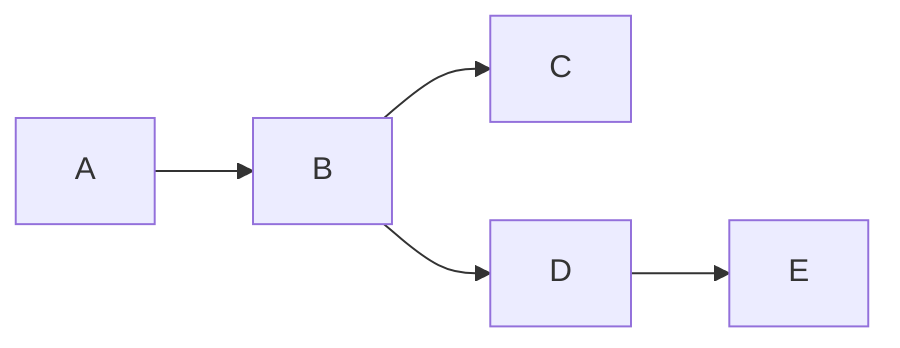
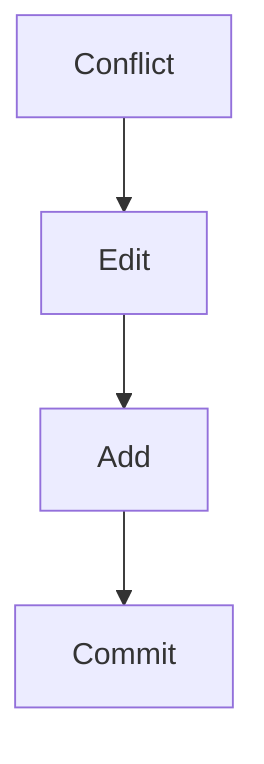
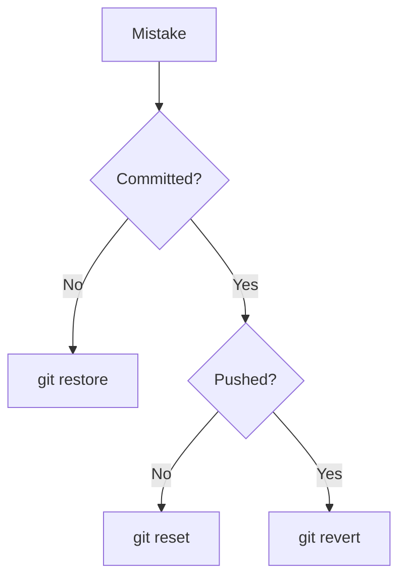
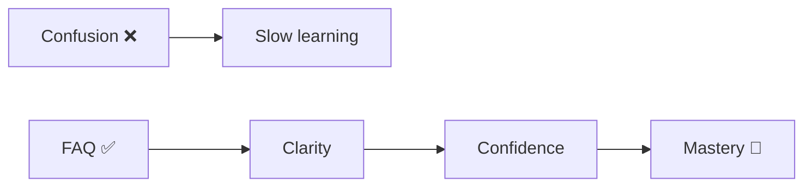

# 🧠 Git FAQ (Top Doubts Answered)

> “If you’re confused, you’re not alone — these are the most common Git questions.”

---

## 🔰 Beginner Level

---

### ❓ What is Git?

```text
Git is a distributed version control system that tracks changes in files over time.
```

👉 It helps you:

* save versions
* collaborate
* recover work

---

### ❓ What is a repository?

```text
A repository (repo) is a project tracked by Git.
```

---

### ❓ What is a commit?

```text
A commit is a snapshot of your project at a specific point in time.
```

---

### ❓ What is a branch?

```text
A branch is a pointer to a commit.
```

👉 Used for:

* features
* experiments
* isolation

---

### ❓ What is HEAD?

```text
HEAD is a pointer to your current commit.
```

---

---

## ⚙️ Workflow Questions

---

### ❓ What is the difference between `git add` and `git commit`?

```text
git add     → moves changes to staging area
git commit  → saves snapshot permanently
```

---

### ❓ What does `git status` do?

```text
Shows current state of your repo (files, changes, branch).
```

---

### ❓ What is the staging area?

```text
A place where you prepare changes before committing.
```

---

---

## 🌿 Branching & Merging

---

### ❓ What is the difference between merge and rebase?

```text
Merge  = combines histories (safe)
Rebase = rewrites history (clean)
```

---



---

### ❓ When should I use rebase?

```text
Use rebase for:
- local work
- clean history
```

---

### ❓ When should I use merge?

```text
Use merge for:
- shared branches
- team collaboration
```

---

---

## ⚔️ Conflicts

---

### ❓ What is a merge conflict?

```text
When Git cannot automatically combine changes.
```

---

### ❓ How do I resolve conflicts?

```text
1. Open file
2. Understand both changes
3. Edit final version
4. git add
5. git commit
```

---



---

---

## 🔄 Undo & Recovery

---

### ❓ What is the difference between reset and revert?

```text
Reset  = move pointer (dangerous)
Revert = create undo commit (safe)
```

---

### ❓ I lost my commit. Is it gone?

```text
No. Use git reflog to recover it.
```

---

### ❓ What is `git reflog`?

```text
A history of where HEAD has been.
```

👉 Your safety net

---

### ❓ How do I undo the last commit?

```bash
git reset --soft HEAD~1
```

---

### ❓ How do I undo a pushed commit?

```bash
git revert <commit>
```

---

---

## 🌍 Remote & Collaboration

---

### ❓ What is the difference between fetch and pull?

```text
Fetch = download changes
Pull  = fetch + merge
```

---

### ❓ Why is my push rejected?

```text
Because remote has new commits.
```

👉 Fix:

```bash
git pull --rebase
```

---

### ❓ What is origin?

```text
Default name for remote repository.
```

---

---

## 🧠 Advanced

---

### ❓ Does Git store diffs or full files?

```text
Git stores snapshots, not just diffs.
```

---

### ❓ What is a SHA?

```text
A unique identifier for a commit.
```

---

### ❓ What is a detached HEAD?

```text
When HEAD points directly to a commit instead of a branch.
```

👉 Fix:

```bash
git checkout -b new-branch
```

---

### ❓ What is cherry-pick?

```text
Apply a specific commit from one branch to another.
```

---

---

## ⚠️ Common Mistakes

---

### ❓ Why is force push dangerous?

```text
It rewrites history and can delete others' work.
```

---

### ❓ Why shouldn’t I work on main?

```text
It makes collaboration risky and unstable.
```

---

---

## 🧭 Decision Questions

---

### ❓ I made a mistake — what should I do?



---

---

## ⚡ Quick Answers (Interview Style)

---

```text
Branch = pointer
Commit = snapshot
Git = DAG
Rebase = rewrite history
Reflog = recovery tool
```

---

---

## 🏁 Final Thought

> “Every Git doubt comes from not understanding state and history.”

---

---

# 🚀 Final Value


