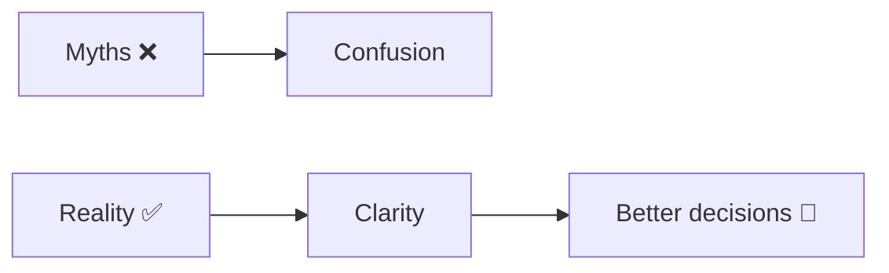
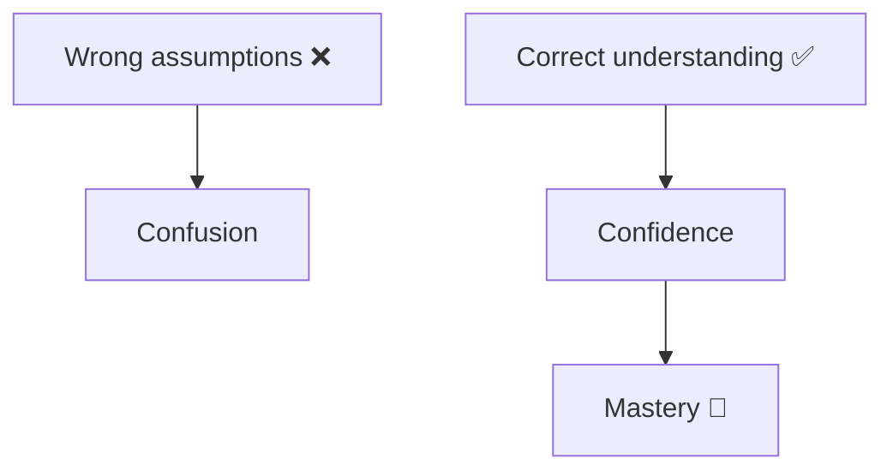
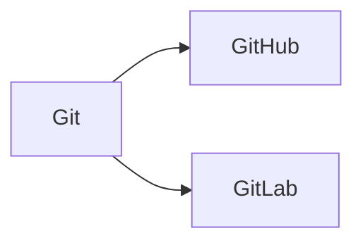
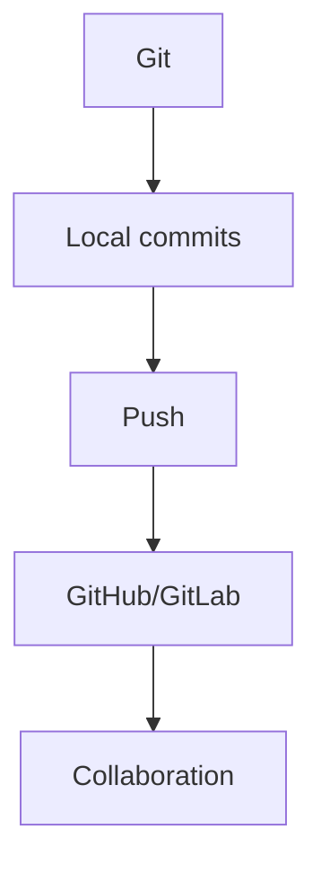
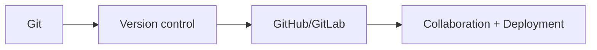
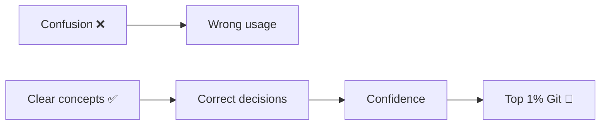

# 🧠 Git Myths vs Reality + Git vs GitHub vs GitLab

> “Most Git confusion comes from wrong assumptions.”

---

# 🔥 Part 1: Git Myths vs Reality

---

## 🧠 Overview



---

## ❌ Myth 1: “Git is very complicated”

### ✅ Reality

```text id="m1"
Git feels complex because:
- too many commands
- poor explanations

But core idea is simple:
→ track snapshots of your project
```

---

## ❌ Myth 2: “Branches are copies of code”

### ✅ Reality

```text id="m2"
Branch = pointer to a commit
```


👉 Lightweight, not copies

---

## ❌ Myth 3: “Git stores changes as diffs”

### ✅ Reality

```text id="m3"
Git stores full snapshots, not just diffs.
```

---

## ❌ Myth 4: “Rebase is dangerous”

### ✅ Reality

```text id="m4"
Rebase is safe when used locally.
Danger only when rewriting shared history.
```

---

## ❌ Myth 5: “Reset deletes data permanently”

### ✅ Reality

```text id="m5"
Data is usually recoverable via reflog.
```

---

## ❌ Myth 6: “Merge conflicts mean something broke”

### ✅ Reality

```text id="m6"
Conflict = Git asking you to choose between changes.
```

---

## ❌ Myth 7: “You must memorize all commands”

### ✅ Reality

```text id="m7"
You only need to understand:
- state
- history
- pointers
```

---

## ❌ Myth 8: “Force push is always bad”

### ✅ Reality

```text id="m8"
Safe on personal branches.
Dangerous on shared branches.
```

---

## ❌ Myth 9: “Git = GitHub”

### ✅ Reality

```text id="m9"
Git = tool
GitHub = platform
```

---

## ❌ Myth 10: “Detached HEAD is broken state”

### ✅ Reality

```text id="m10"
Detached HEAD is normal — just not attached to a branch.
```

---

## 🧠 Myth Summary



---

# 📊 Part 2: Git vs GitHub vs GitLab

---

## 🧠 Big Picture



---

## 🔧 Git (Core Tool)

```text id="g1"
Type: Version Control System
Runs: Locally
Purpose: Track changes
```

### 🧠 What it does

* commits
* branches
* history
* merging

---

## 🌐 GitHub

```text id="g2"
Type: Hosting platform
Runs: Cloud
Purpose: Collaboration
```

### 🧠 Features

* remote repos
* pull requests
* issues
* discussions

---

## ⚙️ GitLab

```text id="g3"
Type: DevOps platform
Runs: Cloud / self-hosted
Purpose: CI/CD + Git hosting
```

### 🧠 Features

* pipelines
* CI/CD
* DevOps tools
* repository hosting

---

---

## ⚔️ Comparison Table

```text id="g4"
Feature        Git        GitHub       GitLab
-----------------------------------------------
Type           Tool       Platform     Platform
Runs           Local      Cloud        Cloud/Self
Purpose        Versioning Collaboration DevOps
CI/CD          No         Limited      Strong
```

---

---

## 🧠 Relationship



---

---

## ⚡ Simple Analogy

```text id="g5"
Git     = engine
GitHub  = car showroom
GitLab  = showroom + service center
```

---

---

## 🎯 When to Use What

---

### Use Git when:

```text id="g6"
You want to track changes locally
```

---

### Use GitHub when:

```text id="g7"
You want to collaborate and share code
```

---

### Use GitLab when:

```text id="g8"
You need CI/CD + DevOps pipelines
```

---

---

# 🧠 Final Understanding



---

---

# 🏁 Final Thought

> “Git is the system.
> GitHub/GitLab are the platforms around it.”

---

---

# 🚀 Final Impact


