# 🧠 Git Mental Models (Deep Dive) + Commit Simulator Guide

> “If you understand these models, Git becomes predictable.”

---

# 🧠 Part 1: Core Mental Models

---

## 🧩 1. Git = Snapshot System (NOT diff system)

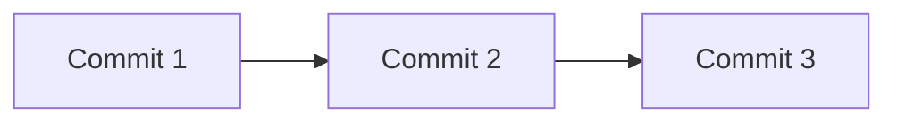

```text
Each commit = full snapshot of your project
```

### ❌ Wrong thinking

“Git stores only changes”

### ✅ Correct thinking

“Git stores the full state at each commit”

---

---

## 🌿 2. Branch = Pointer (NOT copy)

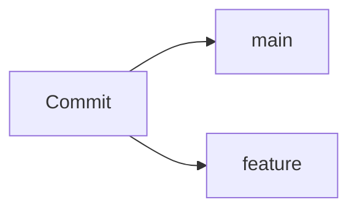

```text
Branch = label pointing to a commit
```

👉 Lightweight, instant, no duplication

---

---

## 🧠 3. HEAD = Your Position

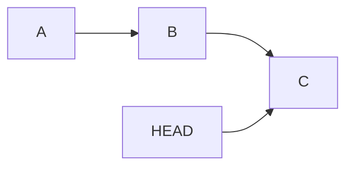

```text
HEAD = where you are right now
```

---

---

## 🔗 4. Commit Graph = DAG (Directed Acyclic Graph)

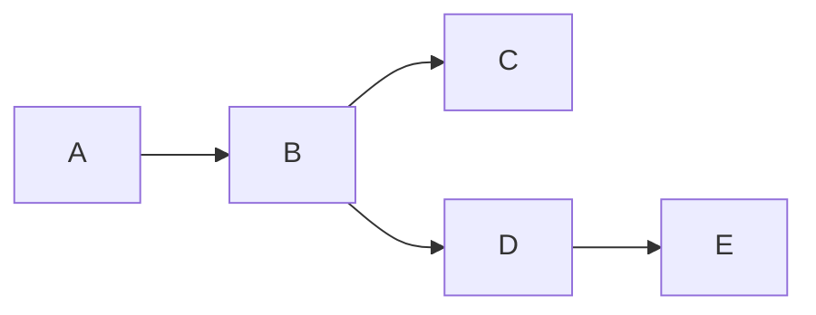

```text
Git history = graph, not a line
```

---

---

## 🔄 5. Rebase = Replay Commits


After rebase:

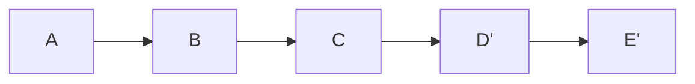

```text
Rebase = move commits to a new base
```

---

---

## 🔀 6. Merge = Combine Histories

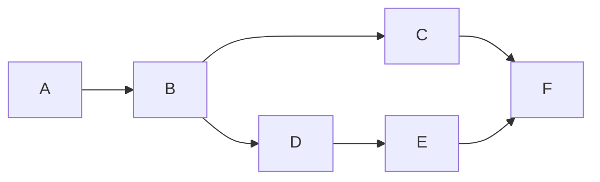

```text
Merge = create new commit combining branches
```

---

---

## 🧪 7. Staging Area = Preparation Zone

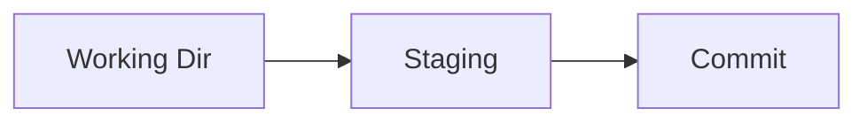

```text
add = prepare
commit = save
```

---

---

## 🧠 8. Reflog = Time Machine

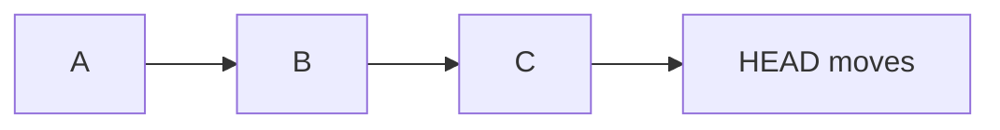

```text
Reflog remembers where HEAD was
```

---

---

# 🎮 Part 2: Commit Simulator Thinking

---

## 🧠 Rule 1: Every command moves pointers

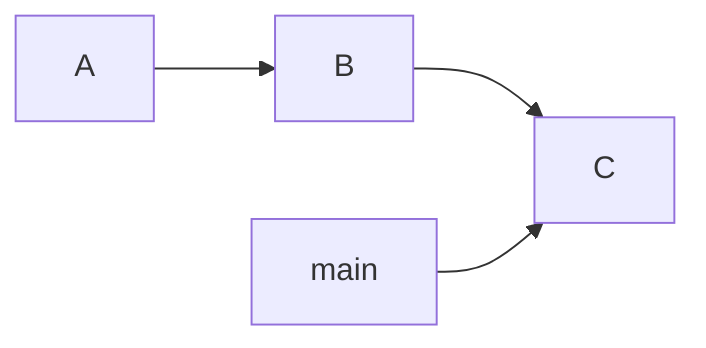

---

## 🧠 Rule 2: Nothing is deleted immediately

```text
Even after reset, commits exist (via reflog)
```

---

---

## 🎯 Simulator Example 1: Commit

```bash
git commit
```

### 🧠 What happens internally

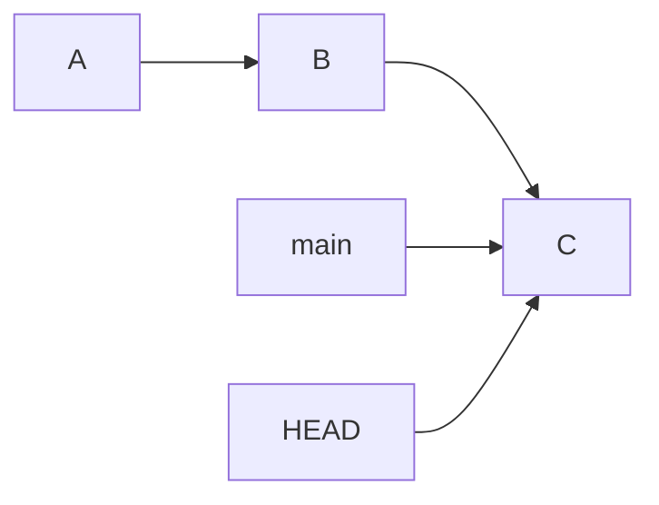

---

---

## 🎯 Simulator Example 2: New Branch

```bash
git switch -c feature
```

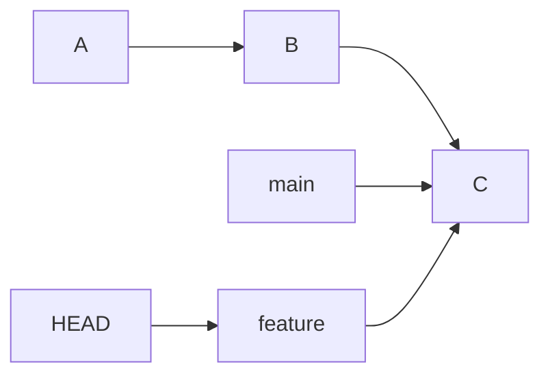

---

---

## 🎯 Simulator Example 3: Reset

```bash
git reset --hard HEAD~1
```

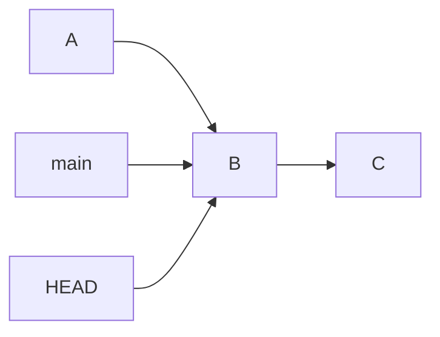

👉 Commit C still exists in memory

---

---

## 🎯 Simulator Example 4: Rebase

```bash
git rebase main
```

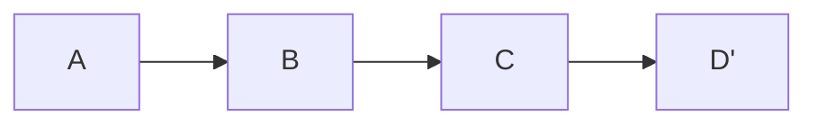

👉 New commits created

---

---

## 🎯 Simulator Example 5: Merge

```bash
git merge feature
```


---

---

# 🧠 Part 3: Command Thinking (Advanced)

---

## 🔄 Reset

```text
Moves branch pointer backward
```

---

## 🔁 Revert

```text
Adds new commit undoing changes
```

---

## 🔀 Rebase

```text
Rewrites commit history
```

---

## ⚔️ Cherry-pick

```text
Copies a specific commit
```

---

---

# 🧭 Part 4: Decision Thinking

---

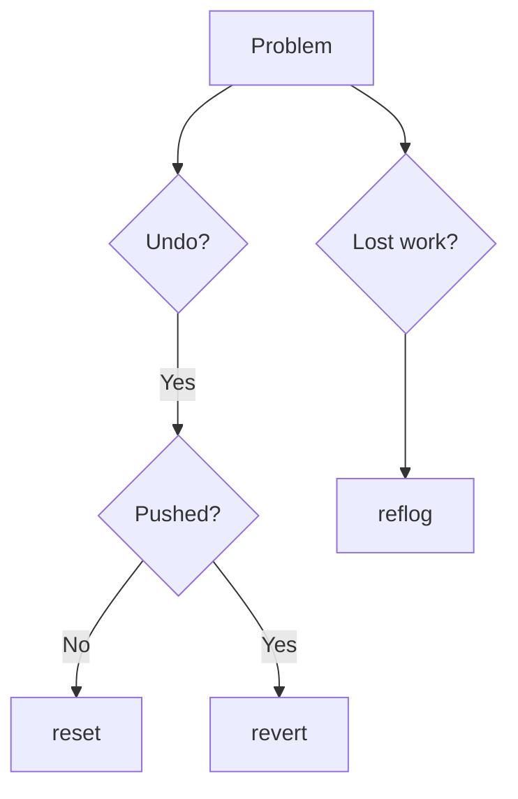

---

---

# ⚡ Part 5: Golden Insights

---

```text
Git = pointers + commits
Branches = labels
HEAD = current pointer
History = graph
```

---

---

# 🧠 Mental Shortcut

```text
Before any command, ask:
→ What pointer will move?
→ What commit will change?
```

---

---

# 🚀 Final Understanding

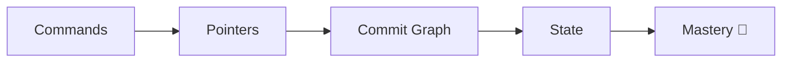

---

---

# 🏁 Final Thought

> “Git becomes easy when you stop thinking in files
> and start thinking in pointers and history.”

---

---

# 🔥 Optional Upgrade (Highly Recommended)

Rename file:

```text
mintal-model.md ❌
mental-model.md ✅
```
