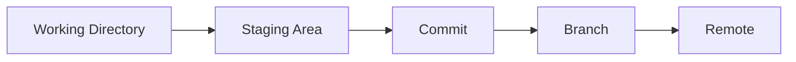
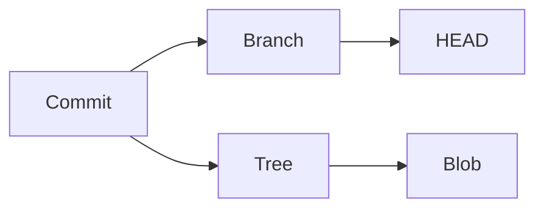
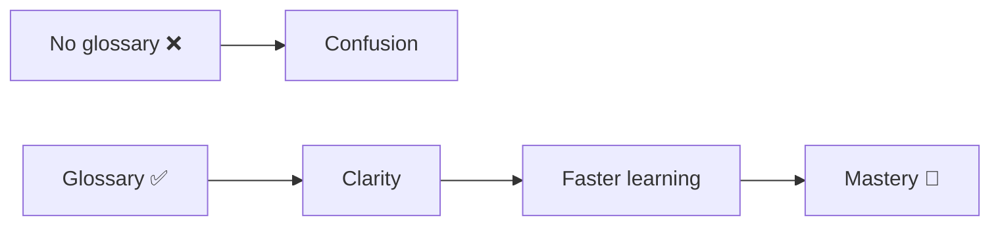

# 📚 Git Glossary (Core Terms Explained)

> “If you understand the words, you understand Git.”

---

## 🧠 Big Picture



---

# 🟢 Core Terms

---

## 📦 Repository (Repo)

```text
A Git project that tracks changes over time.
```

👉 Contains:

* files
* history
* branches

---

## 🧾 Commit

```text
A snapshot of your project at a specific point in time.
```

👉 Each commit has:

* unique ID (SHA)
* message
* changes

---

## 🌿 Branch

```text
A pointer to a commit.
```

👉 Used for:

* features
* experiments
* safe development

---

## 🧠 HEAD

```text
Pointer to the current commit (your current position).
```

---

## 📂 Working Directory

```text
Your actual files on disk.
```

---

## 📌 Staging Area (Index)

```text
Where you prepare changes before committing.
```

---

## 🔀 Merge

```text
Combines changes from one branch into another.
```

---

## 🔄 Rebase

```text
Rewrites commits on top of another base commit.
```

---

## ⚔️ Merge Conflict

```text
Occurs when Git cannot automatically combine changes.
```

---

## 🔁 Clone

```text
Creates a copy of a remote repository locally.
```

---

## 🌍 Remote

```text
A version of your repo hosted elsewhere (e.g., GitHub).
```

---

## 📤 Push

```text
Send local commits to remote repository.
```

---

## 📥 Pull

```text
Fetch + merge changes from remote.
```

---

## 📥 Fetch

```text
Download changes without merging.
```

---

## 🔍 Diff

```text
Shows differences between changes.
```

---

## 🧪 Stash

```text
Temporarily saves changes without committing.
```

---

## 🔄 Reset

```text
Moves branch pointer to another commit.
```

⚠️ Can be destructive

---

## 🔁 Revert

```text
Creates a new commit that undoes a previous commit.
```

👉 Safe for shared history

---

## 🧠 Reflog

```text
History of where HEAD has been.
```

👉 Used for recovery

---

## 🔬 SHA (Hash)

```text
Unique identifier for each commit.
```

---

## 🧱 Blob

```text
Represents file content in Git.
```

---

## 🌳 Tree

```text
Represents directory structure.
```

---

## 🧠 Commit Object

```text
Stores snapshot + metadata + parent reference.
```

---

## 🔗 Tag

```text
A label pointing to a specific commit (often used for releases).
```

---

## 🧪 Cherry-pick

```text
Applies a specific commit from one branch to another.
```

---

## ⚙️ Alias

```text
Custom shortcut for Git commands.
```

---

# ⚡ Quick Relationships



---

# 🧠 Golden Understanding

```text
Git does not store changes as diffs.
Git stores snapshots of your project.
```

---

# ⚠️ Common Confusions

```text
Branch ≠ copy of code
Commit ≠ diff
Rebase ≠ merge
```

---

# 🏁 Final Thought

> “Once these terms are clear, Git becomes predictable.”

---

---

# 🚀 Final Impact


