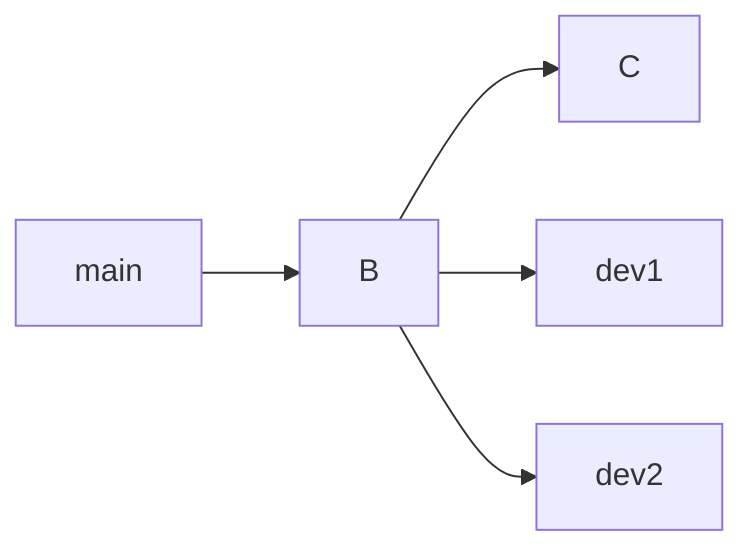

# 👥 Project 02: Team Workflow Simulation

---

## 🎯 Objective

Simulate 2 developers working on same repo.

---

## 🧪 Scenario



---

## ⚙️ Tasks

* Dev1 → feature-login
* Dev2 → feature-navbar
* Both commit
* Merge with conflict

---

## 🧠 Skills

* collaboration
* merge conflicts
* sync

---

## 🏁 Outcome

```text
You can work safely in a team
```
