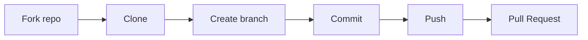

# 🌍 Project 03: Open Source Contribution

---

## 🎯 Objective

Simulate real GitHub contribution.

---

## 🧪 Workflow



---

## ⚙️ Steps

```bash
git clone <forked-repo>
git switch -c fix-typo
git commit -am "fix: typo"
git push origin fix-typo
```

---

## 🧠 Concepts

* fork
* PR
* review

---

## 🏁 Outcome

```text
You can contribute to real projects
```
