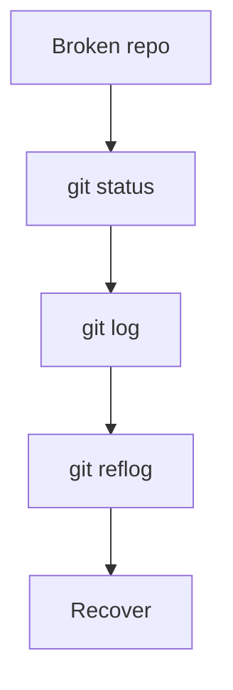

# 🔍 Project 05: Git Debugging Simulation

---

## 🎯 Objective

Fix a broken repository.

---

## 🧪 Scenario

* commits lost
* branch deleted
* wrong merge

---

## 🧠 Debug Flow



---

## ⚙️ Tasks

```bash
git reflog
git checkout -b recovery <commit>
git reset --hard <commit>
```

---

## 🏁 Outcome

```text
You can fix any Git issue
```
