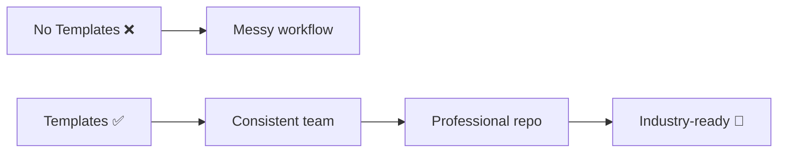

# 🌿 Branch Naming Convention

---

## 🧠 Format

```text
type/short-description
```

---

## 🔤 Types

```text
feature/login
bugfix/navbar
hotfix/payment
chore/update-deps
```

---

## ❌ Avoid

```text
test123
mybranch
temp
```

---

## 🧠 Rule

```text
Readable > short
```

---

---

# 🚀 Final Impact



---

# 🏁 Final Thought

> “Great developers write code.
> Professional developers create systems.”
